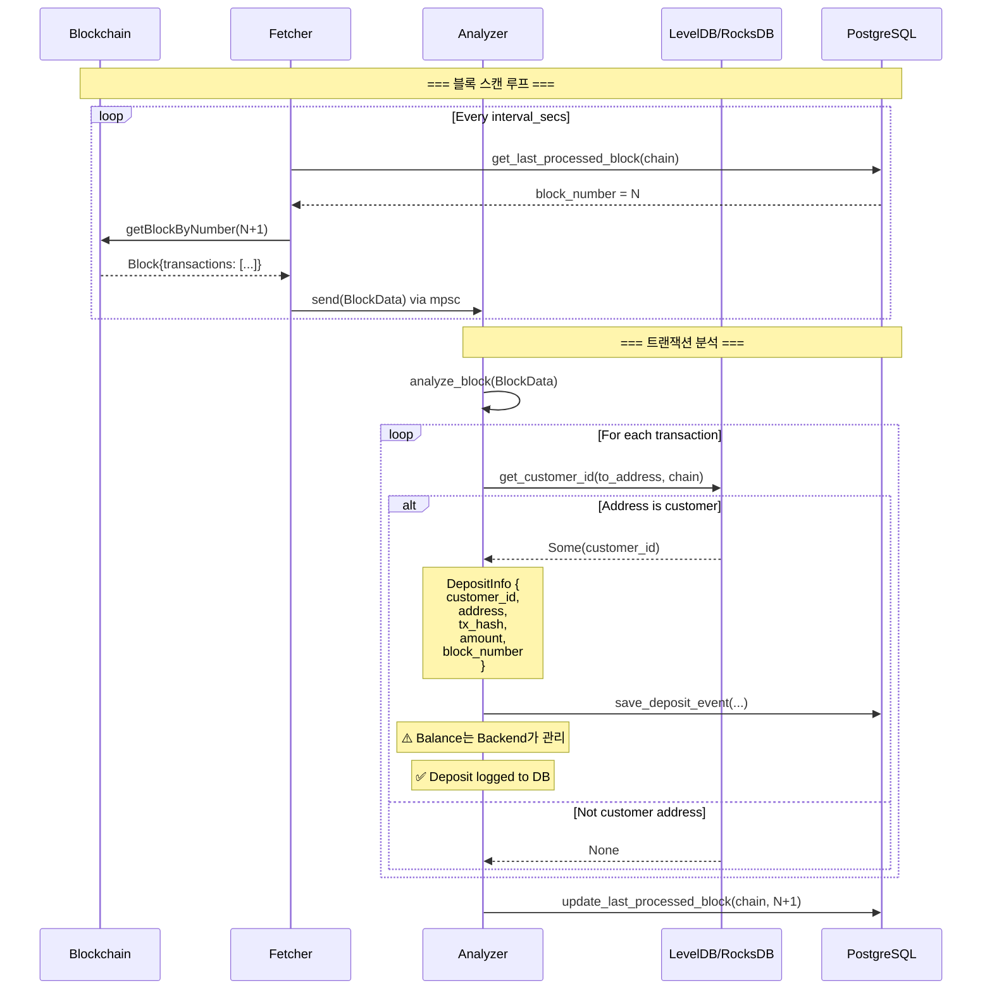
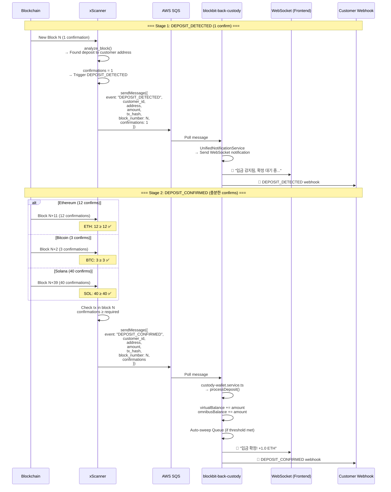

# xScanner Architecture

## Overview

xScanner는 다중 블록체인을 모니터링하여 고객 주소로의 입금을 실시간으로 감지하고, blockbit-back-custody에 알림을 전송하는 Rust 기반 스캐너 서비스입니다.

## Core Components

```
┌─────────────┐
│   Fetcher   │ → 블록체인에서 최신 블록 가져오기
└──────┬──────┘
       │
       ▼ (mpsc channel)
┌─────────────┐
│   Analyzer  │ → 트랜잭션 분석 & 고객 주소 매칭
└──────┬──────┘
       │
       ├─→ PostgreSQL (deposit_events 로깅만)
       └─→ SQS Queue (blockbit-back-custody 알림)
```

### 1. Fetcher (블록 페처)
- **역할**: 블록체인 RPC를 주기적으로 폴링하여 새 블록 가져오기
- **지원 체인**: Ethereum, Bitcoin, TRON, THETA, ICON
- **동작**:
  - `last_processed_block` 조회 → 다음 블록부터 스캔
  - 설정된 `interval_secs`마다 새 블록 체크
  - 새 블록을 mpsc 채널로 Analyzer에 전송

### 2. Analyzer (트랜잭션 분석기)
- **역할**: 블록 내 트랜잭션을 분석하여 고객 주소로의 입금 감지
- **고속 주소 매칭**: LevelDB/RocksDB 캐시 사용
- **처리 흐름**:
  1. 블록 수신
  2. 모든 트랜잭션 순회
  3. `to_address`가 고객 주소인지 확인 (KeyValueDB 조회)
  4. 입금 발견 시 → `process_deposit()` 호출

### 3. Repository (데이터 저장소)
- **PostgreSQL**: 입금 이벤트 로깅(audit), last_processed_block 상태 관리
- **LevelDB/RocksDB**: 고객 주소 캐싱 (빠른 조회)

---

## Role Separation: xScanner vs Backend (역할 분리)

### ⚠️ IMPORTANT: Balance Management Responsibility

**xScanner의 역할**: 입금 이벤트 관찰 및 로깅 (Observer Pattern)
- 블록체인 트랜잭션 스캔
- 고객 주소 매칭
- 입금 이벤트 감지 및 로깅 (`deposit_events` 테이블)
- SQS를 통한 백엔드 알림
- **잔액 관리하지 않음** ❌

**blockbit-back-custody의 역할**: 잔액 관리 및 Source of Truth
- SQS 메시지 수신
- 블록체인 직접 조회로 최종 잔액 확인
- `customer_balances` 테이블 관리 (단일 진실 공급원)
- Sweep 실행 전 블록체인 재확인

### Why This Separation?

1. **Single Source of Truth**: 블록체인이 궁극적인 진실. DB는 캐시일 뿐
2. **Fault Tolerance**: 스캐너가 일부 입금을 놓쳐도, 백엔드가 블록체인 조회로 최종 확인
3. **Data Consistency**: 두 서비스가 같은 잔액 데이터를 관리하면 불일치 발생 가능
4. **Clear Responsibility**: xScanner = 이벤트 로거, Backend = 잔액 매니저

### Database Schema

**xScanner가 관리하는 테이블**:
- `blockchain_state` - 마지막 처리 블록 번호
- `deposit_events` - **입금 이벤트 로그 (audit용)**
- ~~`customer_addresses`~~ - **제거됨** (Backend에서 관리)

**Backend가 관리하는 테이블**:
- `customer_addresses` - 고객 주소 매핑 (Single Source of Truth)
- `customer_balances` - 고객 잔액 (Single Source of Truth)

### Customer Address Sync (고객 주소 동기화)

xScanner는 고객 주소를 **Backend로부터 실시간 동기화**합니다:

```
Backend (고객 가입)
   ↓
customer_addresses 테이블에 INSERT
   ↓
SQS 메시지 발송 (CustomerAddressAdded)
   ↓
xScanner (SQS Consumer)
   ↓
RocksDB 캐시 업데이트 (배치 100개 or 5초마다)
```

**다운타임 대응**:
- xScanner 재시작 시 `customer_addresses_cache.json` 파일에서 로드
- Backend는 주기적으로 전체 주소 목록을 JSON 파일로 export
- 파일이 없으면 SQS 메시지 기반으로만 동작

### Data Flow

```
Backend (고객 주소 관리)
   ↓
   ├─→ SQS (실시간 sync) → xScanner RocksDB
   └─→ File (재시작 대비) → customer_addresses_cache.json

Blockchain → xScanner (입금 감지) → SQS → Backend (잔액 업데이트)
                ↓                                  ↓
         deposit_events (audit)          customer_balances (진실)
```

---

## Deposit Detection Flow (입금 감지 플로우)

### Current Implementation (현재 구현)



---

## New Architecture: Confirmation-Based Notification

### Strategy: 2-Stage Deposit Notification

입금을 2단계로 처리하여 안전성과 UX를 모두 확보합니다:

1. **DEPOSIT_DETECTED** (1 confirmation) - 즉시 알림
2. **DEPOSIT_CONFIRMED** (충분한 confirmation) - 확정 후 sweep 트리거

### Recommended Confirmations by Chain (기관용 커스터디 기준)

| 체인 | 필수 컨펌 수 | 예상 시간 | 근거 |
|-----|------------|----------|------|
| **Bitcoin (BTC)** | **3** | ~30분 | 대형 거래소 2-6 사용, 즉시 출금 아니므로 3이 현실적 |
| **Litecoin (LTC)** | **6** | ~15분 | PoW UTXO 체인, 비트코인보다 블록 빠름 |
| **Ethereum Mainnet** | **12** | ~2.5분 | PoS 전환 후 기관용 서비스 표준 |
| **Arbitrum One** | **12** | ~3분 | L2이지만 Ethereum 동일 정책 적용 |
| **Optimism** | **12** | ~2분 | L2이지만 Ethereum 동일 정책 적용 |
| **Base** | **12** | ~2분 | Coinbase L2, Ethereum 동일 정책 적용 |
| **BNB Chain** | **30** | ~1.5분 | 중앙화 리스크 고려하여 길게 설정 |
| **Polygon PoS** | **30** | ~1분 | 중앙화 리스크 고려하여 길게 설정 |
| **Solana** | **40** | ~20초 | 블록 매우 빠름 (~400ms), 시간으로는 짧음 |
| **Ripple (XRP)** | **3 ledgers** | ~10초 | 기관/커스터디 기준 (1도 많이 사용) |

> **참고**: 위 값은 기관용 커스터디 서비스 기준이며, 체인별 finality 특성과 리스크를 고려한 권장 값입니다.

### Configuration

```toml
# config.toml

[blockchain.ethereum]
api = "https://eth-mainnet.g.alchemy.com/v2/YOUR_API_KEY"
symbol = "ETH"
start_block = 18000000
interval_secs = 12
required_confirmations = 12

[blockchain.bitcoin]
api = "https://blockchain.info"
symbol = "BTC"
start_block = 800000
interval_secs = 600
required_confirmations = 3

[blockchain.arbitrum]
api = "https://arb-mainnet.g.alchemy.com/v2/YOUR_API_KEY"
symbol = "ARB"
start_block = 150000000
interval_secs = 1
required_confirmations = 12

[blockchain.bnb]
api = "https://bsc-dataseed.binance.org"
symbol = "BNB"
start_block = 35000000
interval_secs = 3
required_confirmations = 30

[blockchain.solana]
api = "https://api.mainnet-beta.solana.com"
symbol = "SOL"
start_block = 200000000
interval_secs = 1
required_confirmations = 40

[blockchain.ripple]
api = "https://s1.ripple.com:51234"
symbol = "XRP"
start_block = 80000000
interval_secs = 4
required_confirmations = 3

[notification]
sqs_queue_url = "https://sqs.ap-northeast-2.amazonaws.com/123456789/deposit-events"
aws_region = "ap-northeast-2"
```

### Updated Flow with Confirmations



### Implementation Details

#### 1. Confirmation Tracking

xScanner는 두 가지 이벤트를 발생시킵니다:

```rust
// src/analyzer/analyzer.rs

async fn process_deposit(
    repository: &Arc<RepositoryWrapper>,
    chain_name: &str,
    deposit: DepositInfo,
    current_block: u64,
    required_confirmations: u64,
) -> Result<(), String> {
    let confirmations = current_block.saturating_sub(deposit.block_number) + 1;

    // Stage 1: DEPOSIT_DETECTED (1 confirmation)
    if confirmations == 1 {
        info!(
            "[DEPOSIT_DETECTED] Customer {} received {} {} (tx: {}, confirmations: 1)",
            deposit.customer_id, deposit.amount, chain_name, deposit.tx_hash
        );

        // Send to SQS
        send_to_sqs(SqsEvent::DepositDetected {
            customer_id: deposit.customer_id.clone(),
            address: deposit.address.clone(),
            chain: chain_name.to_string(),
            tx_hash: deposit.tx_hash.clone(),
            amount: deposit.amount.clone(),
            block_number: deposit.block_number,
            confirmations: 1,
        }).await?;

        // Save to DB with status = PENDING
        repository.save_deposit_event(
            &deposit.customer_id,
            &deposit.address,
            chain_name,
            &deposit.tx_hash,
            deposit.block_number,
            &deposit.amount,
            deposit.amount_decimal,
            DepositStatus::Pending,
        ).await?;
    }

    // Stage 2: DEPOSIT_CONFIRMED (required confirmations met)
    if confirmations >= required_confirmations {
        // Check if already confirmed
        let is_confirmed = repository.is_deposit_confirmed(&deposit.tx_hash).await?;

        if !is_confirmed {
            info!(
                "[DEPOSIT_CONFIRMED] Customer {} deposit confirmed with {} confirmations (required: {})",
                deposit.customer_id, confirmations, required_confirmations
            );

            // Send to SQS
            send_to_sqs(SqsEvent::DepositConfirmed {
                customer_id: deposit.customer_id.clone(),
                address: deposit.address.clone(),
                chain: chain_name.to_string(),
                tx_hash: deposit.tx_hash.clone(),
                amount: deposit.amount.clone(),
                block_number: deposit.block_number,
                confirmations,
            }).await?;

            // Update DB status = CONFIRMED
            repository.update_deposit_status(
                &deposit.tx_hash,
                DepositStatus::Confirmed,
            ).await?;

            // Update customer balance
            if let Some(amount_decimal) = deposit.amount_decimal {
                repository.increment_customer_balance(
                    &deposit.customer_id,
                    chain_name,
                    amount_decimal
                ).await?;
            }
        }
    }

    Ok(())
}
```

#### 2. Deposit Tracking in Database

PostgreSQL 스키마에 추가 필요:

```sql
-- deposit_events 테이블에 status 컬럼 추가
ALTER TABLE deposit_events
ADD COLUMN status VARCHAR(20) DEFAULT 'PENDING',
ADD COLUMN confirmations INT DEFAULT 0,
ADD COLUMN detected_at TIMESTAMP DEFAULT NOW(),
ADD COLUMN confirmed_at TIMESTAMP;

-- Index for efficient confirmation checking
CREATE INDEX idx_deposit_events_tx_hash ON deposit_events(tx_hash);
CREATE INDEX idx_deposit_events_status ON deposit_events(status);
CREATE INDEX idx_deposit_events_pending ON deposit_events(status) WHERE status = 'PENDING';
```

#### 3. SQS Integration

```rust
// src/notification/sqs_client.rs (NEW)

use aws_sdk_sqs::Client as SqsClient;
use serde::{Serialize, Deserialize};

#[derive(Debug, Serialize, Deserialize)]
#[serde(tag = "event")]
pub enum SqsEvent {
    DepositDetected {
        customer_id: String,
        address: String,
        chain: String,
        tx_hash: String,
        amount: String,
        block_number: u64,
        confirmations: u64,
    },
    DepositConfirmed {
        customer_id: String,
        address: String,
        chain: String,
        tx_hash: String,
        amount: String,
        block_number: u64,
        confirmations: u64,
    },
}

pub async fn send_to_sqs(
    client: &SqsClient,
    queue_url: &str,
    event: SqsEvent,
) -> Result<(), String> {
    let message_body = serde_json::to_string(&event)
        .map_err(|e| format!("Failed to serialize event: {}", e))?;

    client
        .send_message()
        .queue_url(queue_url)
        .message_body(message_body)
        .send()
        .await
        .map_err(|e| format!("Failed to send SQS message: {}", e))?;

    Ok(())
}
```

---

## Pending Deposits Monitoring (미확정 입금 추적)

### Problem

confirmations가 required보다 작은 PENDING 상태의 입금을 계속 추적해야 합니다.

### Solution: Periodic Confirmation Check

```rust
// src/tasks/confirmation_checker.rs (NEW)

use tokio::time::{interval, Duration};

pub async fn run_confirmation_checker(
    repository: Arc<RepositoryWrapper>,
    chain_configs: HashMap<String, ChainConfig>,
) {
    let mut ticker = interval(Duration::from_secs(60)); // 1분마다 체크

    loop {
        ticker.tick().await;

        // 모든 PENDING 입금 조회
        let pending_deposits = match repository.get_pending_deposits().await {
            Ok(deposits) => deposits,
            Err(e) => {
                error!("Failed to fetch pending deposits: {}", e);
                continue;
            }
        };

        info!("Checking {} pending deposits...", pending_deposits.len());

        for deposit in pending_deposits {
            let chain_config = match chain_configs.get(&deposit.chain) {
                Some(config) => config,
                None => continue,
            };

            // 현재 블록 번호 조회
            let current_block = match repository.get_last_processed_block(&deposit.chain).await {
                Ok(block) => block,
                Err(_) => continue,
            };

            let confirmations = current_block.saturating_sub(deposit.block_number) + 1;

            // Confirmation 도달 시 DEPOSIT_CONFIRMED 발송
            if confirmations >= chain_config.required_confirmations {
                info!(
                    "[Confirmation Checker] Deposit {} reached {} confirmations",
                    deposit.tx_hash, confirmations
                );

                // Send DEPOSIT_CONFIRMED to SQS
                if let Err(e) = send_to_sqs(SqsEvent::DepositConfirmed {
                    customer_id: deposit.customer_id,
                    address: deposit.address,
                    chain: deposit.chain,
                    tx_hash: deposit.tx_hash.clone(),
                    amount: deposit.amount,
                    block_number: deposit.block_number,
                    confirmations,
                }).await {
                    error!("Failed to send DEPOSIT_CONFIRMED: {}", e);
                    continue;
                }

                // Update status
                if let Err(e) = repository.update_deposit_status(
                    &deposit.tx_hash,
                    DepositStatus::Confirmed,
                ).await {
                    error!("Failed to update deposit status: {}", e);
                }
            }
        }
    }
}
```

### PostgreSQL Query

```sql
-- 미확정 입금 조회 (PENDING 상태)
SELECT
    customer_id,
    address,
    chain,
    tx_hash,
    amount,
    block_number,
    detected_at,
    EXTRACT(EPOCH FROM (NOW() - detected_at)) as pending_seconds
FROM deposit_events
WHERE status = 'PENDING'
ORDER BY detected_at ASC;
```

---

## Reorg Handling (Chain Reorganization)

블록체인 재구성(reorg) 발생 시 처리 방법:

### Problem

```
Original: Block 100 → 101 → 102
Reorg:    Block 100 → 101' → 102' (Block 101, 102 무효화)
```

### Solution

1. **Confirmation으로 리스크 완화**
   - Bitcoin (3 confirms): reorg 가능성 매우 낮음
   - Ethereum (12 confirms): PoS 전환 후 거의 불가능
   - Solana (40 confirms): 시간상 20초, 안전성 확보

2. **Reorg 감지 및 복구** (Optional, 고급 기능)
   ```rust
   // 블록 해시 비교로 reorg 감지
   if fetched_block.parent_hash != last_saved_block.hash {
       warn!("Reorg detected! Rolling back...");

       // PENDING 상태의 입금 재검증
       rollback_pending_deposits(last_safe_block).await?;
   }
   ```

---

## Performance Considerations

### Current Bottlenecks

1. **Sequential Block Processing**
   - 현재: 블록 N 처리 완료 → 블록 N+1 fetch
   - 개선: Pipeline 처리 (fetch와 analyze 병렬화)

2. **Database I/O**
   - LevelDB/RocksDB 캐시로 주소 조회 고속화 ✅
   - PostgreSQL write는 batch 처리 가능

### Optimization Strategies

```rust
// Pipeline processing
let (fetch_tx, fetch_rx) = mpsc::channel(10);
let (analyze_tx, analyze_rx) = mpsc::channel(10);

// Fetcher: 10 blocks ahead
tokio::spawn(fetcher_loop(fetch_tx));

// Analyzer: Process while fetching continues
tokio::spawn(analyzer_loop(fetch_rx, analyze_tx));

// Notifier: Send to SQS
tokio::spawn(notifier_loop(analyze_rx));
```

---

## Monitoring & Observability

### Metrics to Track

1. **Scanning Health**
   - `blocks_behind_head`: 최신 블록과의 차이
   - `scan_rate_blocks_per_sec`: 스캔 속도

2. **Deposit Detection**
   - `deposits_detected_total`: 총 입금 감지 수
   - `deposits_confirmed_total`: 총 입금 확정 수
   - `deposit_confirmation_time_seconds`: 감지 → 확정 시간
   - `deposits_pending_count`: 현재 PENDING 상태 입금 수

3. **SQS Integration**
   - `sqs_send_success_total`
   - `sqs_send_failure_total`

### Logging

```rust
info!("[ETH] Block {}: {} deposits detected", block_number, deposits.len());
warn!("[BTC] Deposit {} waiting for confirmations: {}/3", tx_hash, confirmations);
error!("[Scanner] Failed to send SQS notification: {}", err);
```

---

## Deployment

### Docker Compose

```yaml
version: '3.8'

services:
  xscanner:
    build: ..
    environment:
      - RUST_LOG=info
      - AWS_REGION=ap-northeast-2
      - AWS_ACCESS_KEY_ID=${AWS_ACCESS_KEY_ID}
      - AWS_SECRET_ACCESS_KEY=${AWS_SECRET_ACCESS_KEY}
    volumes:
      - ./config.toml:/app/config.toml
      - ./customer_db:/app/customer_db
    restart: unless-stopped
```

### Kubernetes

```yaml
apiVersion: apps/v1
kind: Deployment
metadata:
  name: xscanner
spec:
  replicas: 1  # Single instance (stateful)
  template:
    spec:
      containers:
      - name: xscanner
        image: xscanner:latest
        env:
        - name: RUST_LOG
          value: info
        volumeMounts:
        - name: config
          mountPath: /app/config.toml
          subPath: config.toml
        - name: leveldb
          mountPath: /app/customer_db
```

---

## Future Enhancements

1. **Multi-Region Redundancy**
   - Primary/Standby xScanner 구성
   - Leader election (Consul, etcd)

2. **Event Sourcing**
   - 모든 블록 이벤트를 Kafka에 기록
   - Replay 가능한 감사 로그

3. **Dynamic Configuration**
   - Config 변경 시 재시작 없이 reload
   - 체인 추가/제거 동적 처리

4. **Advanced Reorg Handling**
   - Fork 감지 및 자동 복구
   - Canonical chain 추적

5. **WebSocket RPC Support**
   - HTTP 폴링 대신 WebSocket 구독
   - 실시간 블록 알림 (ETH, BSC 등)

---

## References

- [Bitcoin Confirmations](https://en.bitcoin.it/wiki/Confirmation)
- [Ethereum Finality (PoS)](https://ethereum.org/en/developers/docs/consensus-mechanisms/pos/#finality)
- [Solana Confirmation Depth](https://docs.solana.com/cluster/commitments)
- [XRP Ledger Consensus](https://xrpl.org/consensus.html)
- [AWS SQS Best Practices](https://docs.aws.amazon.com/AWSSimpleQueueService/latest/SQSDeveloperGuide/sqs-best-practices.html)
