# xScanner Architecture

## Overview

xScanner는 다중 블록체인을 모니터링하여 고객 주소로의 입금을 실시간으로 감지하고, blockbit-back-custody에 알림을 전송하는 Rust 기반 스캐너 서비스입니다.

## Key Features ✨

### 🚀 2-Stage Deposit Notification System (IMPLEMENTED)

xScanner는 입금을 **2단계로 처리**하여 안전성과 UX를 모두 확보합니다:

| Stage | Event | Timing | Purpose |
|-------|-------|--------|---------|
| **1. Detection** | `DEPOSIT_DETECTED` | 1 confirmation | 즉시 알림 (UX) |
| **2. Confirmation** | `DEPOSIT_CONFIRMED` | Required confirmations | 확정 후 sweep 트리거 (보안) |

**구현 방식**:
1. **Fetcher + Analyzer**: 새 블록을 스캔하여 입금 발견 시 즉시 `DEPOSIT_DETECTED` 발송
2. **Confirmation Checker** (별도 스케줄러):
   - 30초마다 DB의 미확정 입금(`confirmed=FALSE`)을 조회
   - Required confirmations 도달 시 `DEPOSIT_CONFIRMED` 발송
   - DB 업데이트 (`confirmed=TRUE`)

**Why Separate Scheduler?**
- Fetcher는 새 블록만 스캔하므로, 과거 트랜잭션의 confirmation 증가를 감지하지 못함
- Confirmation Checker가 주기적으로 DB를 폴링하여 해결

**Configuration**:
```toml
[confirmation_checker]
enabled = true  # Default: true
check_interval_secs = 30  # Default: 30

[blockchain.sepolia]
required_confirmations = 6  # Sepolia testnet: 6, Mainnet ETH: 12, BTC: 3, SOL: 40
```

## Core Components

```
┌─────────────┐
│   Fetcher   │ → 블록체인에서 최신 블록 가져오기
└──────┬──────┘
       │
       ▼ (mpsc channel)
┌─────────────┐
│   Analyzer  │ → 트랜잭션 분석 & 고객 주소 매칭
└──────┬──────┘
       │
       ├─→ PostgreSQL (deposit_events 로깅만)
       └─→ SQS Queue (blockbit-back-custody 알림)
```

### 1. Fetcher (블록 페처)
- **역할**: 블록체인 RPC를 주기적으로 폴링하여 새 블록 가져오기
- **지원 체인**: Ethereum, Bitcoin, TRON, THETA, ICON
- **동작**:
  - `last_processed_block` 조회 → 다음 블록부터 스캔
  - 설정된 `interval_secs`마다 새 블록 체크
  - 새 블록을 mpsc 채널로 Analyzer에 전송

### 2. Analyzer (트랜잭션 분석기)
- **역할**: 블록 내 트랜잭션을 분석하여 고객 주소로의 입금 감지
- **고속 주소 매칭**: LevelDB/RocksDB 캐시 사용
- **처리 흐름**:
  1. 블록 수신
  2. 모든 트랜잭션 순회
  3. `to_address`가 고객 주소인지 확인 (KeyValueDB 조회)
  4. 입금 발견 시 → `process_deposit()` 호출

### 3. Repository (데이터 저장소)
- **PostgreSQL**: 입금 이벤트 로깅(audit), last_processed_block 상태 관리
- **LevelDB/RocksDB**: 고객 주소 캐싱 (빠른 조회)

---

## Role Separation: xScanner vs Backend (역할 분리)

### ⚠️ IMPORTANT: Balance Management Responsibility

**xScanner의 역할**: 입금 이벤트 관찰 및 로깅 (Observer Pattern)
- 블록체인 트랜잭션 스캔
- 고객 주소 매칭
- 입금 이벤트 감지 및 로깅 (`deposit_events` 테이블)
- SQS를 통한 백엔드 알림
- **잔액 관리하지 않음** ❌

**blockbit-back-custody의 역할**: 잔액 관리 및 Source of Truth
- SQS 메시지 수신
- 블록체인 직접 조회로 최종 잔액 확인
- `customer_balances` 테이블 관리 (단일 진실 공급원)
- Sweep 실행 전 블록체인 재확인

### Why This Separation?

1. **Single Source of Truth**: 블록체인이 궁극적인 진실. DB는 캐시일 뿐
2. **Fault Tolerance**: 스캐너가 일부 입금을 놓쳐도, 백엔드가 블록체인 조회로 최종 확인
3. **Data Consistency**: 두 서비스가 같은 잔액 데이터를 관리하면 불일치 발생 가능
4. **Clear Responsibility**: xScanner = 이벤트 로거, Backend = 잔액 매니저

### Database Schema

**xScanner가 관리하는 테이블**:
- `blockchain_state` - 마지막 처리 블록 번호
- `deposit_events` - **입금 이벤트 로그 (audit용)**
- ~~`customer_addresses`~~ - **제거됨** (Backend에서 관리)

**Backend가 관리하는 테이블**:
- `customer_addresses` - 고객 주소 매핑 (Single Source of Truth)
- `customer_balances` - 고객 잔액 (Single Source of Truth)

### Custody Wallet Address Structure (Custody Wallet 주소 구조)

xScanner는 두 가지 유형의 주소를 모니터링합니다:

```
Omnibus (Master) Address: 0xMASTER...
├─ 역할: 집금 계좌 (모든 자금이 모이는 곳)
├─ 입금 시나리오:
│   1. 자식 주소들에서 자동 집금 (sweep) ← 메인 시나리오
│   2. UI에서 "입금" 버튼으로 직접 입금 가능 ← 존재는 함
│
└─ Virtual Accounts (자식 주소들): 0x111..., 0x222..., 0x333...
    ├─ 역할: 은행 고객들에게 할당된 입금 전용 주소
    └─ 입금 감지 필요 ✅ (고객 입금 → 자동 집금)
```

**xScanner가 모니터링해야 할 주소**:
1. **Virtual Account 주소들** ✅ 필수
   - 은행 고객의 입금을 감지해야 함
   - `account_id` 있음 (고객 식별)
   - 감지 시 Backend에 알림 → 자동 집금 트리거

2. **Omnibus Address** ✅ 필요
   - 직접 입금은 드물지만 UI에서 가능
   - `account_id` 없음 (null) - Master 주소 표시

**Address Metadata (주소 메타데이터)**:
- `wallet_id`: Custody Wallet 식별자
- `account_id`: Virtual Account ID (Omnibus는 null)

### Customer Address Sync (고객 주소 동기화)

xScanner는 고객 주소를 **Backend로부터 실시간 동기화**합니다:

```
Backend (고객 주소 추가)
   ↓
customer_addresses 테이블에 INSERT
   ↓
SQS 메시지 발송 (AddressAdded)
   {
     "event": "AddressAdded",
     "address": "0x123...",
     "wallet_id": "wallet_uuid",
     "account_id": "account_uuid" (or null for Omnibus),
     "chain": "ETH",
     "timestamp": "2025-12-08T..."
   }
   ↓
xScanner (SQS Consumer)
   ↓
RocksDB 캐시 업데이트 (배치 100개 or 5초마다)
   Key: "eth:0x123..."
   Value: {"wallet_id": "...", "account_id": "..." or null}
```

**다운타임 대응**:
- xScanner 재시작 시 `customer_addresses_cache.json` 파일에서 로드
- Backend는 주기적으로 전체 주소 목록을 JSON 파일로 export
- 파일이 없으면 SQS 메시지 기반으로만 동작

### Data Flow

```
Backend (고객 주소 관리)
   ↓
   ├─→ SQS (실시간 sync) → xScanner RocksDB
   └─→ File (재시작 대비) → customer_addresses_cache.json

Blockchain → xScanner (입금 감지) → SQS → Backend (잔액 업데이트)
                ↓                                  ↓
         deposit_events (audit)          customer_balances (진실)
```

---

## Deposit Detection Flow (입금 감지 플로우)

### Current Implementation (현재 구현)

```mermaid
sequenceDiagram
    participant Chain as Blockchain
    participant Fetcher as Fetcher
    participant Analyzer as Analyzer
    participant KV as LevelDB/RocksDB
    participant PG as PostgreSQL

    Note over Chain,PG: === 블록 스캔 루프 ===

    loop Every interval_secs
        Fetcher->>PG: get_last_processed_block(chain)
        PG-->>Fetcher: block_number = N

        Fetcher->>Chain: getBlockByNumber(N+1)
        Chain-->>Fetcher: Block{transactions: [...]}

        Fetcher->>Analyzer: send(BlockData) via mpsc
    end

    Note over Analyzer,PG: === 트랜잭션 분석 ===

    Analyzer->>Analyzer: analyze_block(BlockData)

    loop For each transaction
        Analyzer->>KV: get_customer_id(to_address, chain)

        alt Address is customer
            KV-->>Analyzer: Some(customer_id)

            Note over Analyzer: DepositInfo {<br/>  customer_id,<br/>  address,<br/>  tx_hash,<br/>  amount,<br/>  block_number<br/>}

            Analyzer->>PG: save_deposit_event(...)
            Note over Analyzer: ⚠️ Balance는 Backend가 관리

            Note over Analyzer: ✅ Deposit logged to DB
        else Not customer address
            KV-->>Analyzer: None
        end
    end

    Analyzer->>PG: update_last_processed_block(chain, N+1)
```



---

## New Architecture: Confirmation-Based Notification

### Strategy: 2-Stage Deposit Notification

입금을 2단계로 처리하여 안전성과 UX를 모두 확보합니다:

1. **DEPOSIT_DETECTED** (1 confirmation) - 즉시 알림
2. **DEPOSIT_CONFIRMED** (충분한 confirmation) - 확정 후 sweep 트리거

### Recommended Confirmations by Chain (기관용 커스터디 기준)

| 체인 | 필수 컨펌 수 | 예상 시간 | 근거 |
|-----|------------|----------|------|
| **Bitcoin (BTC)** | **3** | ~30분 | 대형 거래소 2-6 사용, 즉시 출금 아니므로 3이 현실적 |
| **Litecoin (LTC)** | **6** | ~15분 | PoW UTXO 체인, 비트코인보다 블록 빠름 |
| **Ethereum Mainnet** | **12** | ~2.5분 | PoS 전환 후 기관용 서비스 표준 |
| **Arbitrum One** | **12** | ~3분 | L2이지만 Ethereum 동일 정책 적용 |
| **Optimism** | **12** | ~2분 | L2이지만 Ethereum 동일 정책 적용 |
| **Base** | **12** | ~2분 | Coinbase L2, Ethereum 동일 정책 적용 |
| **BNB Chain** | **30** | ~1.5분 | 중앙화 리스크 고려하여 길게 설정 |
| **Polygon PoS** | **30** | ~1분 | 중앙화 리스크 고려하여 길게 설정 |
| **Solana** | **40** | ~20초 | 블록 매우 빠름 (~400ms), 시간으로는 짧음 |
| **Ripple (XRP)** | **3 ledgers** | ~10초 | 기관/커스터디 기준 (1도 많이 사용) |

> **참고**: 위 값은 기관용 커스터디 서비스 기준이며, 체인별 finality 특성과 리스크를 고려한 권장 값입니다.

### Configuration

```toml
# config.toml

[blockchain.ethereum]
api = "https://eth-mainnet.g.alchemy.com/v2/YOUR_API_KEY"
symbol = "ETH"
start_block = 18000000
interval_secs = 12
required_confirmations = 12

[blockchain.bitcoin]
api = "https://blockchain.info"
symbol = "BTC"
start_block = 800000
interval_secs = 600
required_confirmations = 3

[blockchain.arbitrum]
api = "https://arb-mainnet.g.alchemy.com/v2/YOUR_API_KEY"
symbol = "ARB"
start_block = 150000000
interval_secs = 1
required_confirmations = 12

[blockchain.bnb]
api = "https://bsc-dataseed.binance.org"
symbol = "BNB"
start_block = 35000000
interval_secs = 3
required_confirmations = 30

[blockchain.solana]
api = "https://api.mainnet-beta.solana.com"
symbol = "SOL"
start_block = 200000000
interval_secs = 1
required_confirmations = 40

[blockchain.ripple]
api = "https://s1.ripple.com:51234"
symbol = "XRP"
start_block = 80000000
interval_secs = 4
required_confirmations = 3

[notification]
sqs_queue_url = "https://sqs.ap-northeast-2.amazonaws.com/123456789/deposit-events"
aws_region = "ap-northeast-2"
```

### Updated Flow with Confirmations (IMPLEMENTED)

```mermaid
sequenceDiagram
    participant Chain as Blockchain
    participant Fetcher as Fetcher
    participant Analyzer as Analyzer
    participant DB as PostgreSQL
    participant Checker as ConfirmationChecker
    participant SQS as AWS SQS
    participant Backend as blockbit-back-custody

    Note over Chain,Backend: === Stage 1: DEPOSIT_DETECTED (1 confirmation) ===

    Chain->>Fetcher: getBlock(N)
    Fetcher->>Analyzer: BlockData via mpsc
    Analyzer->>Analyzer: Found deposit to customer address

    Analyzer->>DB: save_deposit_event(..., confirmed=FALSE)
    Analyzer->>SQS: DEPOSIT_DETECTED {<br/>  address, wallet_id, account_id,<br/>  chain, tx_hash, amount,<br/>  block_number: N, confirmations: 1<br/>}

    SQS->>Backend: Poll message
    Backend->>Backend: 🔔 "입금 감지됨"

    Note over Chain,Backend: === Stage 2: DEPOSIT_CONFIRMED (충분한 확인) ===
    Note over Checker: ⏰ Every 30 seconds

    loop Confirmation Checker
        Checker->>DB: SELECT * FROM deposit_events<br/>WHERE confirmed = FALSE
        DB-->>Checker: [pending deposits]

        loop For each pending deposit
            Checker->>DB: get_last_processed_block(chain)
            DB-->>Checker: current_block

            Checker->>Checker: confirmations = <br/>current_block - block_number + 1

            alt confirmations >= required_confirmations
                Checker->>DB: is_deposit_confirmed(tx_hash)?
                DB-->>Checker: FALSE (not confirmed yet)

                Checker->>DB: UPDATE deposit_events<br/>SET confirmed = TRUE<br/>WHERE tx_hash = ...

                Checker->>SQS: DEPOSIT_CONFIRMED {<br/>  address, wallet_id, account_id,<br/>  chain, tx_hash, amount,<br/>  block_number, confirmations<br/>}

                SQS->>Backend: Poll message
                Backend->>Backend: 🔔 "입금 확정!"<br/>→ processDeposit()<br/>→ Auto-sweep Queue
            else confirmations < required
                Note over Checker: Wait for more blocks...
            end
        end
    end
```



### Implementation Details

#### 1. Confirmation Tracking

xScanner는 두 가지 이벤트를 발생시킵니다:

```rust
// src/analyzer/analyzer.rs

async fn process_deposit(
    repository: &Arc<RepositoryWrapper>,
    chain_name: &str,
    deposit: DepositInfo,
    current_block: u64,
    required_confirmations: u64,
) -> Result<(), String> {
    let confirmations = current_block.saturating_sub(deposit.block_number) + 1;

    // Stage 1: DEPOSIT_DETECTED (1 confirmation)
    if confirmations == 1 {
        info!(
            "[DEPOSIT_DETECTED] Customer {} received {} {} (tx: {}, confirmations: 1)",
            deposit.customer_id, deposit.amount, chain_name, deposit.tx_hash
        );

        // Send to SQS
        send_to_sqs(SqsEvent::DepositDetected {
            customer_id: deposit.customer_id.clone(),
            address: deposit.address.clone(),
            chain: chain_name.to_string(),
            tx_hash: deposit.tx_hash.clone(),
            amount: deposit.amount.clone(),
            block_number: deposit.block_number,
            confirmations: 1,
        }).await?;

        // Save to DB with status = PENDING
        repository.save_deposit_event(
            &deposit.customer_id,
            &deposit.address,
            chain_name,
            &deposit.tx_hash,
            deposit.block_number,
            &deposit.amount,
            deposit.amount_decimal,
            DepositStatus::Pending,
        ).await?;
    }

    // Stage 2: DEPOSIT_CONFIRMED (required confirmations met)
    if confirmations >= required_confirmations {
        // Check if already confirmed
        let is_confirmed = repository.is_deposit_confirmed(&deposit.tx_hash).await?;

        if !is_confirmed {
            info!(
                "[DEPOSIT_CONFIRMED] Customer {} deposit confirmed with {} confirmations (required: {})",
                deposit.customer_id, confirmations, required_confirmations
            );

            // Send to SQS
            send_to_sqs(SqsEvent::DepositConfirmed {
                customer_id: deposit.customer_id.clone(),
                address: deposit.address.clone(),
                chain: chain_name.to_string(),
                tx_hash: deposit.tx_hash.clone(),
                amount: deposit.amount.clone(),
                block_number: deposit.block_number,
                confirmations,
            }).await?;

            // Update DB status = CONFIRMED
            repository.update_deposit_status(
                &deposit.tx_hash,
                DepositStatus::Confirmed,
            ).await?;

            // Update customer balance
            if let Some(amount_decimal) = deposit.amount_decimal {
                repository.increment_customer_balance(
                    &deposit.customer_id,
                    chain_name,
                    amount_decimal
                ).await?;
            }
        }
    }

    Ok(())
}
```

#### 2. Deposit Tracking in Database

PostgreSQL 스키마에 추가 필요:

```sql
-- deposit_events 테이블에 status 컬럼 추가
ALTER TABLE deposit_events
ADD COLUMN status VARCHAR(20) DEFAULT 'PENDING',
ADD COLUMN confirmations INT DEFAULT 0,
ADD COLUMN detected_at TIMESTAMP DEFAULT NOW(),
ADD COLUMN confirmed_at TIMESTAMP;

-- Index for efficient confirmation checking
CREATE INDEX idx_deposit_events_tx_hash ON deposit_events(tx_hash);
CREATE INDEX idx_deposit_events_status ON deposit_events(status);
CREATE INDEX idx_deposit_events_pending ON deposit_events(status) WHERE status = 'PENDING';
```

#### 3. SQS Integration

```rust
// src/notification/sqs_client.rs (NEW)

use aws_sdk_sqs::Client as SqsClient;
use serde::{Serialize, Deserialize};

#[derive(Debug, Serialize, Deserialize)]
#[serde(tag = "event")]
pub enum SqsEvent {
    DepositDetected {
        customer_id: String,
        address: String,
        chain: String,
        tx_hash: String,
        amount: String,
        block_number: u64,
        confirmations: u64,
    },
    DepositConfirmed {
        customer_id: String,
        address: String,
        chain: String,
        tx_hash: String,
        amount: String,
        block_number: u64,
        confirmations: u64,
    },
}

pub async fn send_to_sqs(
    client: &SqsClient,
    queue_url: &str,
    event: SqsEvent,
) -> Result<(), String> {
    let message_body = serde_json::to_string(&event)
        .map_err(|e| format!("Failed to serialize event: {}", e))?;

    client
        .send_message()
        .queue_url(queue_url)
        .message_body(message_body)
        .send()
        .await
        .map_err(|e| format!("Failed to send SQS message: {}", e))?;

    Ok(())
}
```

---

## Pending Deposits Monitoring (미확정 입금 추적) - **IMPLEMENTED**

### Problem

DEPOSIT_DETECTED 이벤트는 즉시 발생하지만, DEPOSIT_CONFIRMED 이벤트는 required_confirmations에 도달해야 발생합니다.

문제는 Fetcher가 **새 블록만 스캔**하기 때문에, 과거 블록의 트랜잭션이 confirmation 임계값에 도달해도 감지되지 않습니다.

### Solution: Periodic Confirmation Checker (구현 완료)

**구현 위치**: `src/tasks/confirmation_checker.rs`

별도의 백그라운드 스케줄러가 주기적으로 DB의 미확정 입금을 체크하고, required_confirmations에 도달하면 DEPOSIT_CONFIRMED를 발송합니다.

### Configuration (config.toml)

```toml
[confirmation_checker]
enabled = true  # Enable/disable confirmation checker
check_interval_secs = 30  # Check every 30 seconds
```

**설정 설명**:
- `enabled`: confirmation checker 활성화 여부 (기본값: `true`)
- `check_interval_secs`: 확인 주기 (초 단위, 기본값: `30`)

### Implementation (실제 구현)

```rust
// src/tasks/confirmation_checker.rs

use crate::respository::RepositoryWrapper;
use crate::notification::sqs_client::SqsNotifier;
use crate::config::ChainConfig;
use tokio::time::{interval, Duration};

pub struct PendingDeposit {
    pub address: String,
    pub wallet_id: String,
    pub account_id: Option<String>,
    pub chain_name: String,
    pub tx_hash: String,
    pub block_number: u64,
    pub amount: String,
    pub amount_decimal: Option<rust_decimal::Decimal>,
}

pub async fn run_confirmation_checker(
    repository: Arc<RepositoryWrapper>,
    chain_configs: HashMap<String, ChainConfig>,
    sqs_notifier: Option<Arc<SqsNotifier>>,
    config: ConfirmationCheckerConfig,
) {
    if !config.enabled {
        info!("[ConfirmationChecker] Disabled by configuration, skipping...");
        return;
    }

    let mut check_interval = interval(Duration::from_secs(config.check_interval_secs));

    loop {
        check_interval.tick().await;

        // 1. Get all pending (unconfirmed) deposits from database
        let pending_deposits = repository.get_pending_deposits().await?;

        // 2. For each pending deposit
        for deposit in pending_deposits {
            let required_confirmations = chain_configs
                .get(&deposit.chain_name.to_uppercase())
                .map(|c| c.required_confirmations)
                .unwrap_or(12);

            // 3. Get current block number for this chain
            let current_block = repository.get_last_processed_block(&deposit.chain_name).await?;

            // 4. Calculate confirmations
            let confirmations = current_block.saturating_sub(deposit.block_number) + 1;

            // 5. Check if reached required confirmations
            if confirmations >= required_confirmations {
                // 6. Double-check to prevent duplicates
                let is_confirmed = repository.is_deposit_confirmed(&deposit.tx_hash).await?;

                if !is_confirmed {
                    info!(
                        "[ConfirmationChecker] ✅ Deposit {} reached {} confirmations, sending DEPOSIT_CONFIRMED",
                        deposit.tx_hash, confirmations
                    );

                    // 7. Update database (mark as confirmed)
                    repository.update_deposit_confirmed(&deposit.tx_hash).await?;

                    // 8. Send SQS notification
                    if let Some(notifier) = sqs_notifier.as_ref() {
                        notifier.send_deposit_confirmed(
                            deposit.address,
                            deposit.wallet_id,
                            deposit.account_id,
                            deposit.chain_name.to_uppercase(),
                            deposit.tx_hash,
                            deposit.amount,
                            deposit.block_number,
                            confirmations,
                        ).await?;
                    }
                }
            }
        }
    }
}
```

### Database Schema (deposit_events)

```sql
CREATE TABLE IF NOT EXISTS deposit_events (
    id SERIAL PRIMARY KEY,
    address VARCHAR(255) NOT NULL,
    wallet_id VARCHAR(255) NOT NULL,
    account_id VARCHAR(255),
    chain_name VARCHAR(50) NOT NULL,
    tx_hash VARCHAR(255) NOT NULL,
    block_number BIGINT NOT NULL,
    amount VARCHAR(255) NOT NULL,
    amount_decimal NUMERIC(36, 18),
    confirmed BOOLEAN DEFAULT FALSE,  -- ✅ confirmation_checker가 TRUE로 업데이트
    created_at TIMESTAMP DEFAULT CURRENT_TIMESTAMP,
    UNIQUE(chain_name, tx_hash)
);

-- Index for efficient queries
CREATE INDEX idx_de_confirmed ON deposit_events (confirmed) WHERE confirmed = FALSE;
```

### Repository Methods Added

```rust
// src/respository/trait.rs

#[async_trait]
pub trait Repository: Send + Sync {
    // ... existing methods ...

    /// Get all pending (unconfirmed) deposits for confirmation checking
    async fn get_pending_deposits(&self) -> Result<Vec<crate::tasks::PendingDeposit>, AppError>;
}
```

**구현된 Repository**:
- ✅ `PostgreSQLRepository::get_pending_deposits()` - `WHERE confirmed = FALSE ORDER BY block_number ASC`
- ✅ `MemoryRepository::get_pending_deposits()` - In-memory filtering
- ✅ `RocksDBRepository::get_pending_deposits()` - Iterator-based scanning
- ✅ `RepositoryWrapper::get_pending_deposits()` - Delegate pattern

### Main Integration (src/main.rs)

```rust
// 8.5. Spawn confirmation checker task
let confirmation_checker_handle = if let Some(confirmation_checker_config) = &settings.confirmation_checker {
    let checker_config = crate::tasks::ConfirmationCheckerConfig {
        enabled: confirmation_checker_config.enabled,
        check_interval_secs: confirmation_checker_config.check_interval_secs,
    };

    let chain_configs_map: std::collections::HashMap<String, config::ChainConfig> =
        settings.get_chain_configs().into_iter().collect();

    Some(tokio::spawn(crate::tasks::run_confirmation_checker(
        repository.clone(),
        chain_configs_map,
        sqs_notifier.clone(),
        checker_config,
    )))
} else {
    // Use default config if not specified
    Some(tokio::spawn(crate::tasks::run_confirmation_checker(
        repository.clone(),
        settings.get_chain_configs().into_iter().collect(),
        sqs_notifier.clone(),
        crate::tasks::ConfirmationCheckerConfig::default(),
    )))
};
```

### Flow Diagram: Confirmation Checker

```
┌────────────────────────────────────────────────────────────────┐
│  Confirmation Checker Loop (every 30 seconds)                  │
└────────────────────────────────────────────────────────────────┘
                            │
                            ▼
        ┌────────────────────────────────────────┐
        │ SELECT * FROM deposit_events           │
        │ WHERE confirmed = FALSE                │
        └────────────────┬───────────────────────┘
                         │
                         ▼
        ┌────────────────────────────────────────┐
        │ For each pending deposit:              │
        │  1. Get current_block from repository  │
        │  2. Calculate confirmations            │
        │  3. Check if >= required_confirmations │
        └────────────────┬───────────────────────┘
                         │
                         ▼
        ┌────────────────────────────────────────┐
        │ confirmations >= required?             │
        └────┬───────────────────────────────┬───┘
             │ YES                           │ NO
             ▼                               ▼
┌──────────────────────────┐       ┌────────────────┐
│ 1. Update confirmed=TRUE │       │ Continue       │
│ 2. Send SQS (CONFIRMED)  │       └────────────────┘
└──────────────────────────┘
```

---

## Reorg Handling (Chain Reorganization)

블록체인 재구성(reorg) 발생 시 처리 방법:

### Problem

```
Original: Block 100 → 101 → 102
Reorg:    Block 100 → 101' → 102' (Block 101, 102 무효화)
```

### Solution

1. **Confirmation으로 리스크 완화**
   - Bitcoin (3 confirms): reorg 가능성 매우 낮음
   - Ethereum (12 confirms): PoS 전환 후 거의 불가능
   - Solana (40 confirms): 시간상 20초, 안전성 확보

2. **Reorg 감지 및 복구** (Optional, 고급 기능)
   ```rust
   // 블록 해시 비교로 reorg 감지
   if fetched_block.parent_hash != last_saved_block.hash {
       warn!("Reorg detected! Rolling back...");

       // PENDING 상태의 입금 재검증
       rollback_pending_deposits(last_safe_block).await?;
   }
   ```

---

## Performance Considerations

### Current Bottlenecks

1. **Sequential Block Processing**
   - 현재: 블록 N 처리 완료 → 블록 N+1 fetch
   - 개선: Pipeline 처리 (fetch와 analyze 병렬화)

2. **Database I/O**
   - LevelDB/RocksDB 캐시로 주소 조회 고속화 ✅
   - PostgreSQL write는 batch 처리 가능

### Optimization Strategies

```rust
// Pipeline processing
let (fetch_tx, fetch_rx) = mpsc::channel(10);
let (analyze_tx, analyze_rx) = mpsc::channel(10);

// Fetcher: 10 blocks ahead
tokio::spawn(fetcher_loop(fetch_tx));

// Analyzer: Process while fetching continues
tokio::spawn(analyzer_loop(fetch_rx, analyze_tx));

// Notifier: Send to SQS
tokio::spawn(notifier_loop(analyze_rx));
```

---

## Monitoring & Observability

### Metrics to Track

1. **Scanning Health**
   - `blocks_behind_head`: 최신 블록과의 차이
   - `scan_rate_blocks_per_sec`: 스캔 속도

2. **Deposit Detection**
   - `deposits_detected_total`: 총 입금 감지 수
   - `deposits_confirmed_total`: 총 입금 확정 수
   - `deposit_confirmation_time_seconds`: 감지 → 확정 시간
   - `deposits_pending_count`: 현재 PENDING 상태 입금 수

3. **SQS Integration**
   - `sqs_send_success_total`
   - `sqs_send_failure_total`

### Logging

```rust
info!("[ETH] Block {}: {} deposits detected", block_number, deposits.len());
warn!("[BTC] Deposit {} waiting for confirmations: {}/3", tx_hash, confirmations);
error!("[Scanner] Failed to send SQS notification: {}", err);
```

---

## Deployment

### Docker Compose

```yaml
version: '3.8'

services:
  xscanner:
    build: ..
    environment:
      - RUST_LOG=info
      - AWS_REGION=ap-northeast-2
      - AWS_ACCESS_KEY_ID=${AWS_ACCESS_KEY_ID}
      - AWS_SECRET_ACCESS_KEY=${AWS_SECRET_ACCESS_KEY}
    volumes:
      - ./config.toml:/app/config.toml
      - ./customer_db:/app/customer_db
    restart: unless-stopped
```

### Kubernetes

```yaml
apiVersion: apps/v1
kind: Deployment
metadata:
  name: xscanner
spec:
  replicas: 1  # Single instance (stateful)
  template:
    spec:
      containers:
      - name: xscanner
        image: xscanner:latest
        env:
        - name: RUST_LOG
          value: info
        volumeMounts:
        - name: config
          mountPath: /app/config.toml
          subPath: config.toml
        - name: leveldb
          mountPath: /app/customer_db
```

---

## Future Enhancements

1. **Multi-Region Redundancy**
   - Primary/Standby xScanner 구성
   - Leader election (Consul, etcd)

2. **Event Sourcing**
   - 모든 블록 이벤트를 Kafka에 기록
   - Replay 가능한 감사 로그

3. **Dynamic Configuration**
   - Config 변경 시 재시작 없이 reload
   - 체인 추가/제거 동적 처리

4. **Advanced Reorg Handling**
   - Fork 감지 및 자동 복구
   - Canonical chain 추적

5. **WebSocket RPC Support**
   - HTTP 폴링 대신 WebSocket 구독
   - 실시간 블록 알림 (ETH, BSC 등)

---

## References

- [Bitcoin Confirmations](https://en.bitcoin.it/wiki/Confirmation)
- [Ethereum Finality (PoS)](https://ethereum.org/en/developers/docs/consensus-mechanisms/pos/#finality)
- [Solana Confirmation Depth](https://docs.solana.com/cluster/commitments)
- [XRP Ledger Consensus](https://xrpl.org/consensus.html)
- [AWS SQS Best Practices](https://docs.aws.amazon.com/AWSSimpleQueueService/latest/SQSDeveloperGuide/sqs-best-practices.html)
