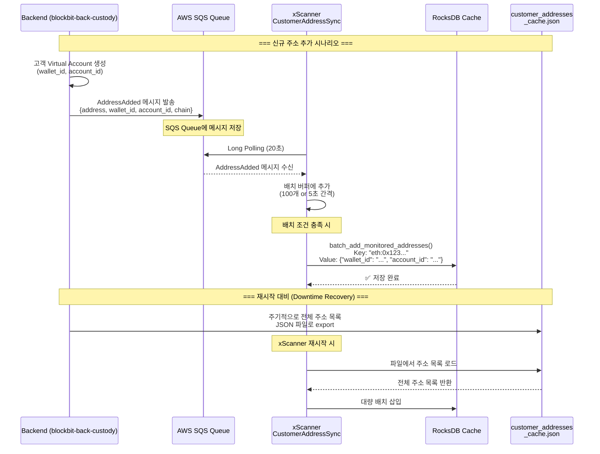
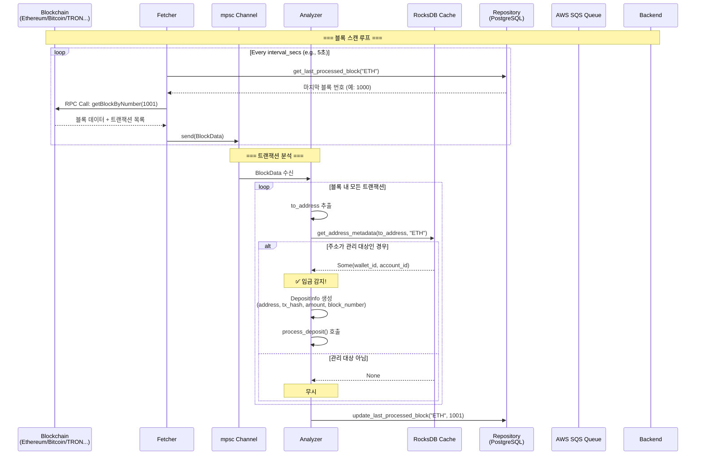
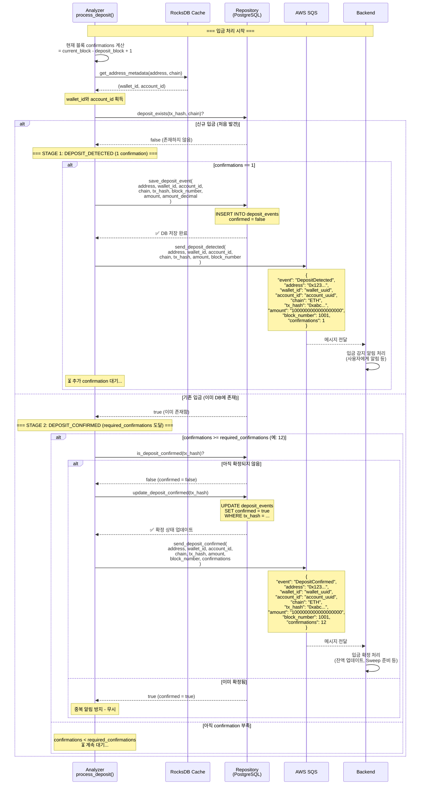
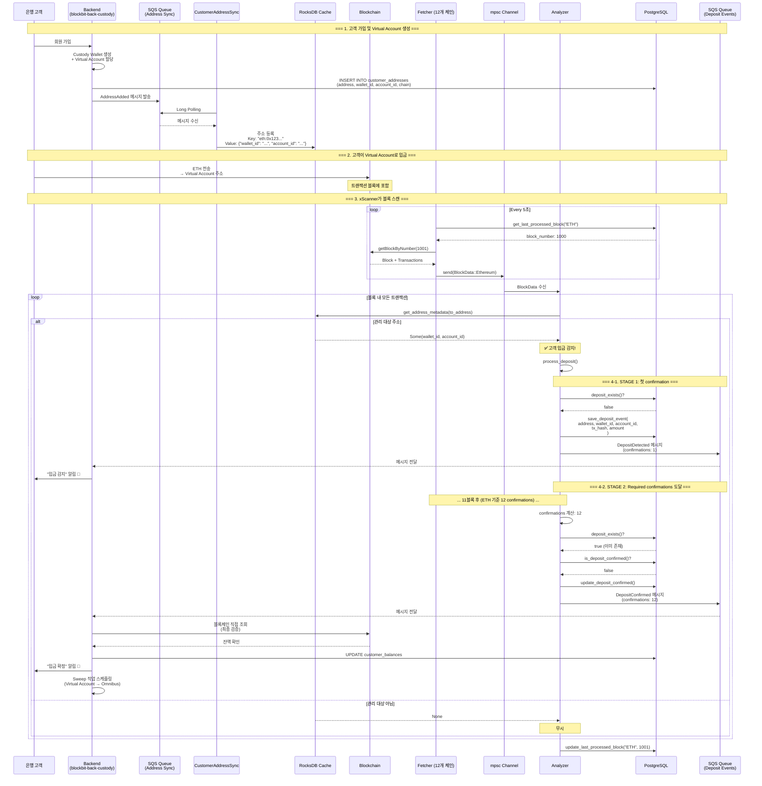
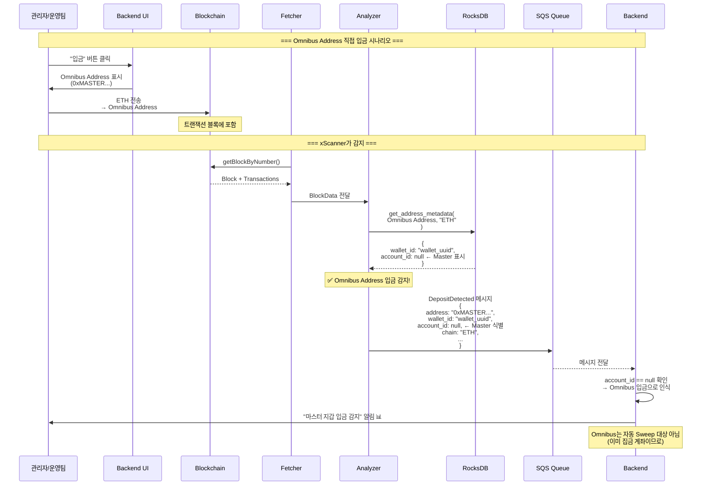
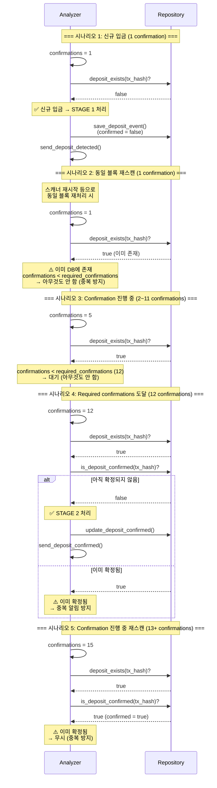

# xScanner Sequence Diagrams

## 1. 주소 동기화 플로우 (Address Synchronization)

Backend에서 새 주소가 추가되면 xScanner가 실시간으로 동기화합니다.

## 2. 입금 감지 플로우 (Deposit Detection)

블록체인에서 입금을 감지하고 2단계로 알림을 보내는 과정입니다.

## 3. 입금 처리 및 Confirmation 플로우 (2-Stage Deposit Notification)

입금 감지 후 1차 알림(DEPOSIT_DETECTED)과 2차 확정 알림(DEPOSIT_CONFIRMED)을 보내는 과정입니다.

## 4. 전체 시스템 플로우 (Complete System Flow)

모든 컴포넌트가 어떻게 상호작용하는지 전체 플로우입니다.

## 5. Omnibus (Master) Address 입금 플로우

Master Address로의 직접 입금 처리입니다.

## 6. 중복 방지 메커니즘 (Duplicate Prevention)

같은 트랜잭션을 여러 번 알림하지 않도록 하는 메커니즘입니다.

## 핵심 개념 정리

### 1. Two-Stage Notification
- **STAGE 1 (DEPOSIT_DETECTED)**: confirmations == 1
  - 첫 confirmation 시 즉시 알림
  - 빠른 사용자 피드백
  - DB에 `confirmed = false`로 저장

- **STAGE 2 (DEPOSIT_CONFIRMED)**: confirmations >= required_confirmations
  - 필요한 confirmation 수 도달 시 확정 알림
  - `confirmed = true`로 업데이트
  - Backend에서 실제 잔액 처리 시작

### 2. Duplicate Prevention (중복 방지)
- `deposit_exists()`: 이미 DB에 있는지 확인
- `is_deposit_confirmed()`: 이미 확정됐는지 확인
- UNIQUE constraint: (chain_name, tx_hash)

### 3. Address Metadata
- **wallet_id**: Custody Wallet 식별자 (필수)
- **account_id**: Virtual Account ID
  - 있으면: Virtual Account (고객 주소)
  - null이면: Omnibus Address (Master 주소)

### 4. RocksDB Cache
- **Key**: `chain_name:address` (소문자 정규화)
- **Value**: `{"wallet_id": "...", "account_id": "..." or null}`
- **목적**: 빠른 주소 조회 (O(1))

### 5. Required Confirmations (체인별)
- Ethereum: 12 blocks
- Bitcoin: 6 blocks
- TRON: 19 blocks
- 설정 가능 (`config.toml`)
